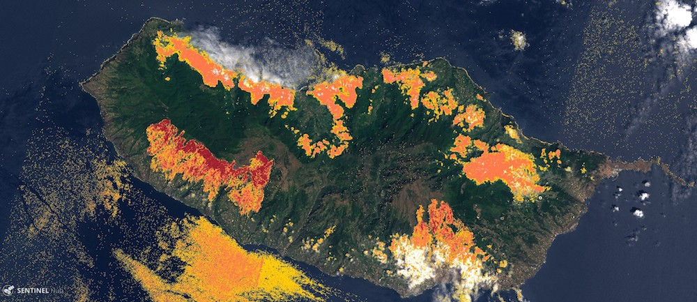

# forest-segmentation

This repository contains a series of notebooks presenting a tutorial and an analysis on how to treat sentinel2 data to obtain an image segmentation of forest. Please see the notebooks directory for the different steps.

## Running instructions

In order to run the notebooks you can use the docker image available.

1. Build it or download it:
  - `docker build . -t trogger/forest-segmentation:latest`
  - `docker pull trogger/forest-segmentation:latest`
2. Run `docker run -p 8888:8888 --rm -v $(pwd)/notebooks:/usr/src/notebooks -v $(pwd)/data:/usr src/data --env-file=.env trogger/forest-segmentation:latest`

You can create the `.env` file to store the different env variables that you will need like the Copernicus credentials.

## Notebooks

### Collection

This is where we will download the data needed and explain what we are going to do. You will learn about basic notions of remote sensing there and about the type of data we will be using.

You will learn there about the [CORINE](https://land.copernicus.eu/pan-european/corine-land-cover/clc2018) dataset and how to download its data. You will also be able to download fresh sentinel2 data for later pre-processing and training. If you want to work with another region than the default's Normandy, you have to replace the `region.geojson` in the `data/` directory first. 

### Pre-processing

This is where we will prepare the data downloaded previously for further experiments with it. In there you will learn about satellite imagery representations and useful notions.

In this notebook, you will learn to load and read data from a `.jp2` file. As we need to align sentinel2 images with CORINE's following these steps:

1. Warping sentinel2 images to CORINE's coordinate reference system
2. Resampling sentinel2 images to fit CORINE's resolution
3. Croping CORINE image to fit the sentinel2 tile

Alongside this image alignment we'll be computing features later needed by the model. Those features are documented in the notebook. Last but not least, we will be creating a mask of the tile using ESA's provided SCL data. The outcome of this notebook are new tiles where input features, labels and mask are aligned and packed together as layers of a same image.